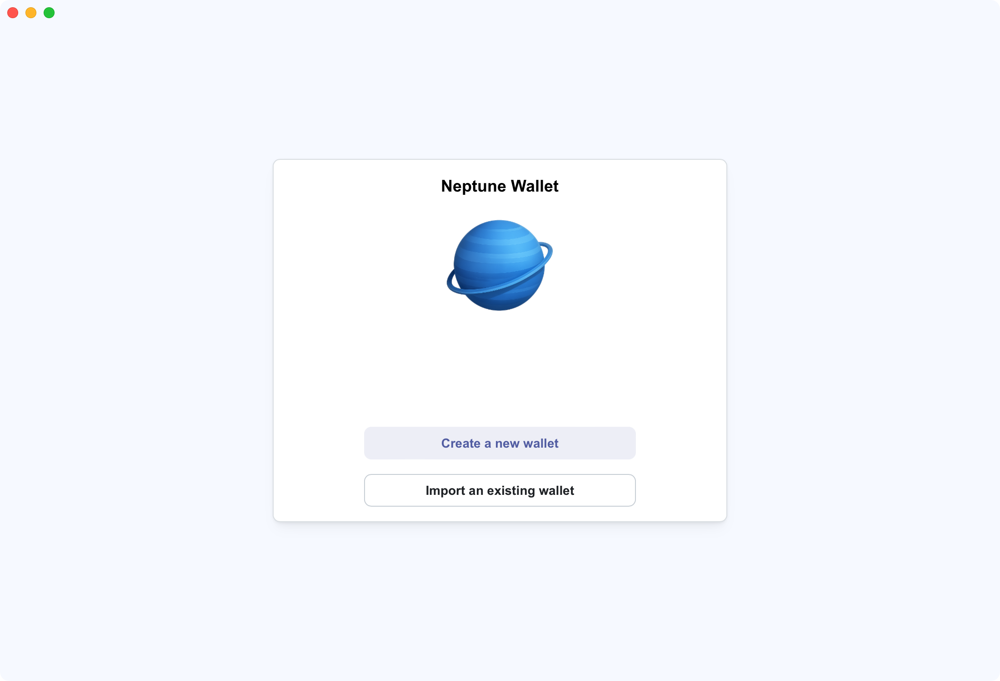
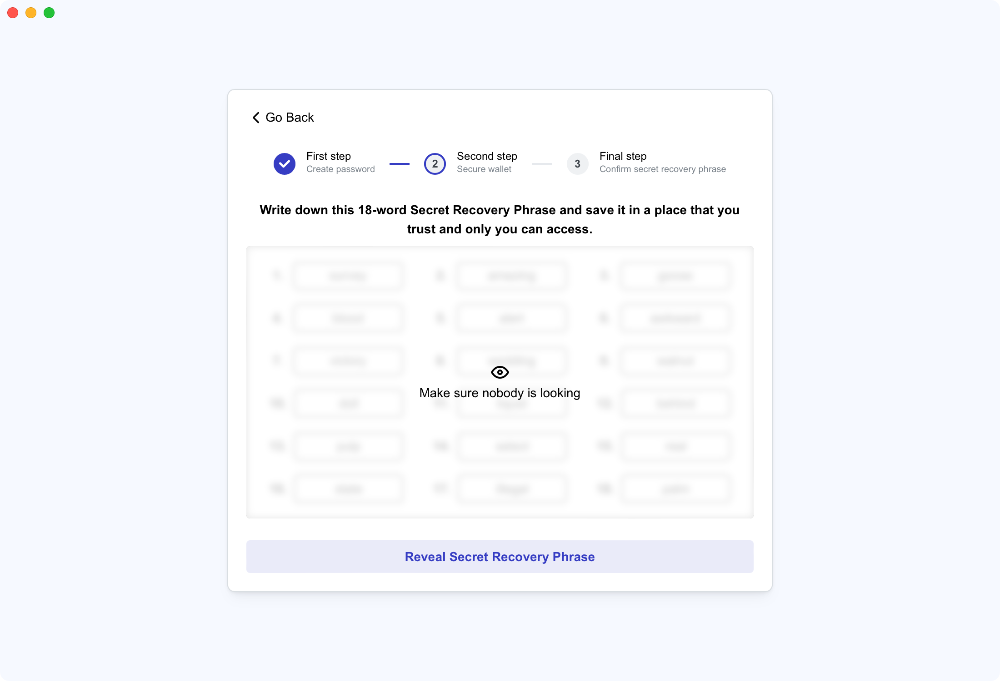
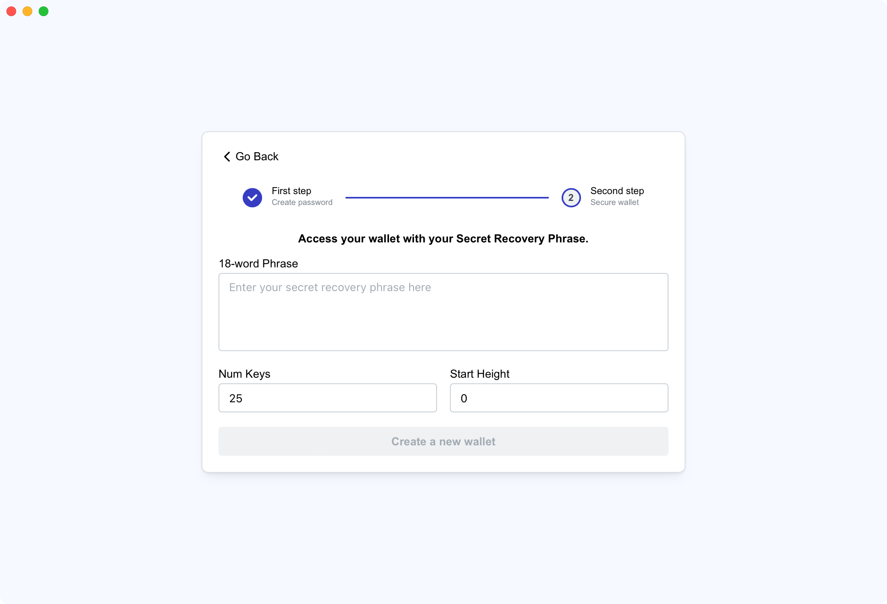
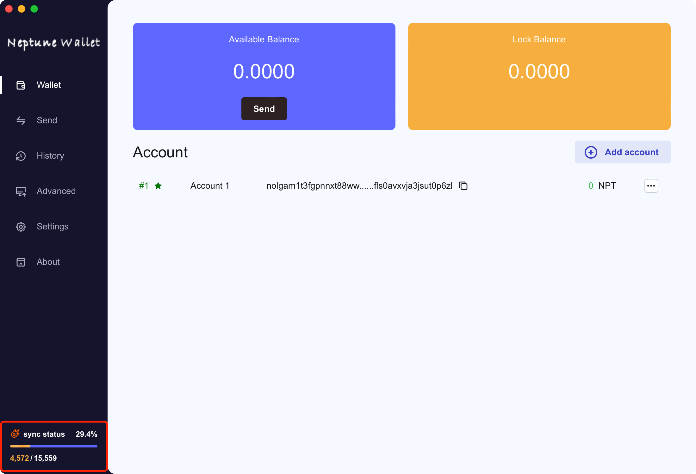
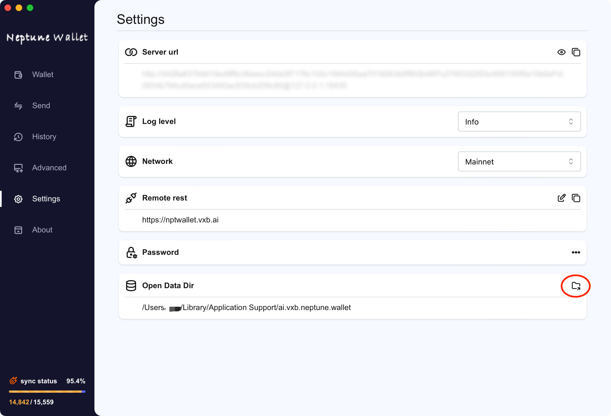
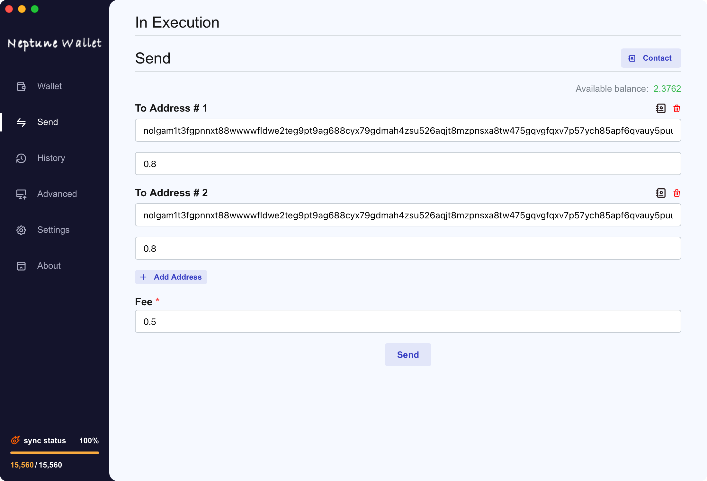
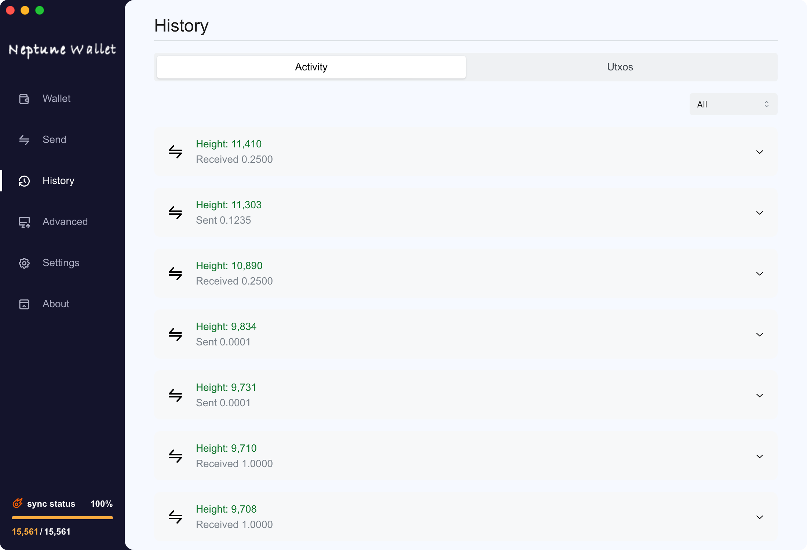
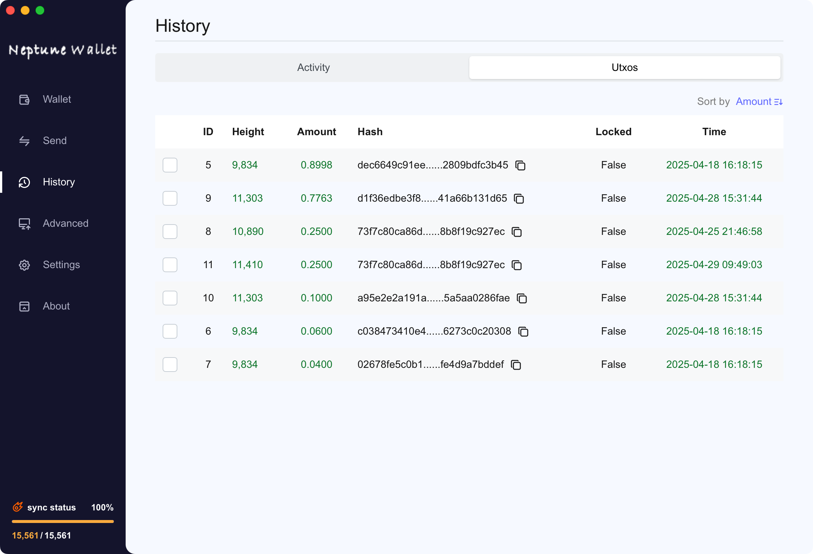

# vxb_neptune_wallet

> NOTE:
> this is release repo, for sourcecode, please navigate to https://github.com/VxBlocks/neptune-wallet-app

Neptune's inaugural wallet program


## Download

[latest](https://github.com/VxBlocks/vxb_neptune_wallet/releases/latest)

## Install

Double-click the software

**Mac**
- you need to enable application from any source, drag the app to application folder, then run the following command:

```
sudo xattr -d com.apple.quarantine /Applications/NeptuneWallet.app
```

## Wallet Setup

### Create Wallet


### Import Wallet


## Data Synchronization


**Accelerated Sync via Snapshot**
1. download [snapshot](snapshot.md)
2. Oepn Data Dir

3. Import all snapshots into the currently opened file
4. Restart the App

## Send

1. Enter recipient address
2. Enter transfer amount
3. To send to multiple recipients, click "Add Address"
4. Network fee: Minimum 0.5 NPT (priority increases with fee amount)
5. click "Send"
Processing your transaction...

## History



## Donation
VXB Neptune Wallet, as the community's first desktop wallet application, is committed to providing users with a secure and convenient digital asset management experience. We sincerely invite community support and recognition - your donations will help drive the project's continued development.

`nolgam1s04yrynvkgkwujenyzrmulqzslu85s7qn3se9qlzax3dw6jjwhfwqhf89uajlxznxrsjujhx40fvglug2njsm2exw8ee4lwgf5l8qkluulyy8fge93uqkxsg3gqmmd3cphhjcyeq7jdzfe7atle4p3hsvf74nzlnzma858ggvg9e5g56j5m4n4xgu9hdt5xmhys68v6crq6jmrsdvyhwhuqmxhxjdhnw05ejz7qjaqkg066q2ueqd3gm2x8j8ypgl5sufcwfd29tuuw86utq24rqy8r4c7gx5xv0eqz7nt4cw0hvmkpj559nr6q8uqx8dv58jf2x2lnfu7q3vgdmealfrx8lklhgz2hcrzz6ss52ytlrlzlr6jgcfxzznwgq5txnvdmylfe8jt73lshkmfhekahh7l8whw6m20jlaj98jpw4ucp9md7fr5yzr4trrlmp47q04xy9kd4gz36drxq930cg6pcs4adggqm09g4j6w7txcq3zpkexh68qwt6hgzp3uy4zafmnxsgmxzujvvh8mn83jl56556lqt8mpqqk3603dwp902tcc54eeahu7t9pvaxc6g0v6uvqqlwn7rt4kuhpn36yrnyecux2q647q8f5ply6qlhjn9rjp75k7y5rwaar5x6dxqhu72nyxxal37m99r8ye6z3hsty0ewgy9740rymh7xyt4zwmsvamw5mz64yusse3nml0c8xhh9jep9pw3supluahhqjua69aan3ucnuxegexshk0mxlas3h2na7zymkwxjc4wglyqhgthf3jc3adcjj2veumcc0syzakkq8zxf5yn8ryya3xu6rn8nc9nk3g7a9l2q5xaw4xd7xxpdlj65xupnypz6c84ug5zpv0kspztpqeepl2ysxm0wszg8a0g5040mcm3jppaqdp8sk5wsg0wjqfjt3yzfcggv74srl00drlmgdrll5gujcmpwvhc964dzrvfjz5vutc6a37j06thrlc3gqzd4autaawvm5673fgywgj30vcwp2xjpnzg2eawfg9fdpz2h8dxmyusuhtd4sl7699gd9ssztd9e2tqsp4mvyejgakkduyyx27ccxj08faj90c32m7uq8wwgwqxlqax8rkgz2lz3wwjyypd65qeeuzkt4l6k6d5twsx30xyt9jewt8nrvls8hgkgj5vzkxfkjj7s3seee9f45q0y06q384z7tff4axmdw6x4j3sjyzqehxy36rg6cjgv59xd46h7833al9ka70akefqf2eu6s2zlsetgnud99w3qk3mzjw2r2y5zm55zsl0xhzrg4lksglghxmsp5tq7ewjzh39k2vu3nejenu0a3qn57kgwfqpdemethm7sfec79w9a43ehz5rpfk96x0dfuv6hy77vsukggrz6k9yt7ckn8r9qk77yhpzdwwlljhu37g7jlt708gz98v07sj6q3n5xk80f3u2nds60j9cucyqpmy8nhkrjs69jhf4fd8zglllftk4upqkv2duwq5celh03xyajfqza4g35lhqd7pwz7tlytne8t24danp3t6k209rl9uez7le9fdd3p3m227kjumwm0y6l6d9eglppqapvvl0p7uh0fqyyag4e6mvalee662vadrmxv3mylrjlpvaeauwj0zl89s6vt4us9nye85taskquw5ycnsmavxkthe3g6k0zf8jh0txlgguu2yz7w356u40vlpdhdvawtncrjs623d0d9gnaxlmcgswd0ymcmmam2txu94lcwul7tl2hc0qx6d25a6ezutm2lerljh4z02ctjucjlqxer94wsx7ql3acktxq6265gc7f4tl4nrx8vn6a4fva8xavedpagsnus6alh7pu2a0957wwys2p4lvssshj04se9gf0a7ve5utznr8wa46hvrd4ytddsvkfrscwlr938pg6ggzya7a6vl5c5tcmtrw75585nfwne90p3gk07l6c370dfn05788sngyqwevk7wcpnak6yjweyssq8hxp384mhu66k0n0v3luqey0986vkarkmh4f3f6ppwrj8dwjje5nrxd529ungry98utwev6k5tvlmeyaak7uvsn70d6pndtrzn9tmvmkmxytgyljgdwzclg7glk6adzu4manxzmd7rtrp5hka0cz2amrzkpdqpq2ecdv9ensrnh8uqmdyhrenm3azy3tycsgn5s387z2gh2akyejscrh9c7n5qq78uyc5zk8r3d9vhz9v9jg3h6jamcpnyyg6n82jhffrd9k2xmgy5e6wm88agwwpu8snaapj9qptlecc5w4szqtllre3msmhzp5usu45hp4atlt9urxs679q6xqvvmjg3q3gj7jf2xk6d0jx5hpk0upmhesnkxsn34gpvnlw2cr4e8c026mm9lzcx5v2f04kmxqajev7m28e77srv8ns24n5zcl6jv40l33wahwsaxlhut3hestj6schwj5x9ajjp3j6qtpn9qyf2r6x33efhf6s5gq6sdhg3256y3vl9kle70zn3mmyl8g2hdl8pgcfmjr7lc86s8hvnssypdmtmlfzm9jcjtwvfcetef45qyehapvkg7y36ykrv6c085nczutxayny5etaeh6afhm6xvr38693c0d2axzcdttfqktj6gpr5dvy6u7mdkgfan24v0skzgnah598kxjwszaj0zqyyhpw8pa9fts29shhpm76kytvquysckd68d22v777026m072ws0nad4thj3vfk4hzqfj83s4uvtu8rvxn87yt665um63sapuysxnszvjddjpp0zhq9pnmcc3duv07phnteexzg8phmrc2m2udf49lq0x90k5vsu0gjajxmv7j0qg75ynuxepxfnnwsqhd4esj46ea9vl7pyeey6ls65p5kkv600mt4tj27akfy9m00zrhj8qf8f7svhulev0mxq3rm6ztdtfwtznzca8sacnwgsz4z5uuwkc0qd04yec8xsrlvt59pyqkxa6jr84xr6puqkj0kexus9nmug68ed3e6tkr9p5v4r2el3nyv2dfspk62w4w3cg5wl9j77v8v4d7vy62trl7j0p0jdx80dg5kxjgd2myl8kystlpsaeegzs2uzhfa95al4nmz5d3w9w3len7qmhvshqjsthm9m0jej7ejx9gm8xtfqd4k8u0jc9lp67vye0q7h5szt3q5k070epgr3hll79ustyfznjj47p8l798wqr6z0p77lagw00axetd6fvy7a4fmpc0d7um7e9m8qvp6p44zqfg96gh804aw76qp78d4eush3k0k4c4wfwnv5f9aqrff95vgazauu0kwj9ejs895ut90yc2c5xv35ad3wrxvrm4kcddp4k44y225senyv29dxauf3j3fq80eehjtumal6h8dp69cdkau40wfa32m408zhtxlj6q7vxz2vwnrk`
