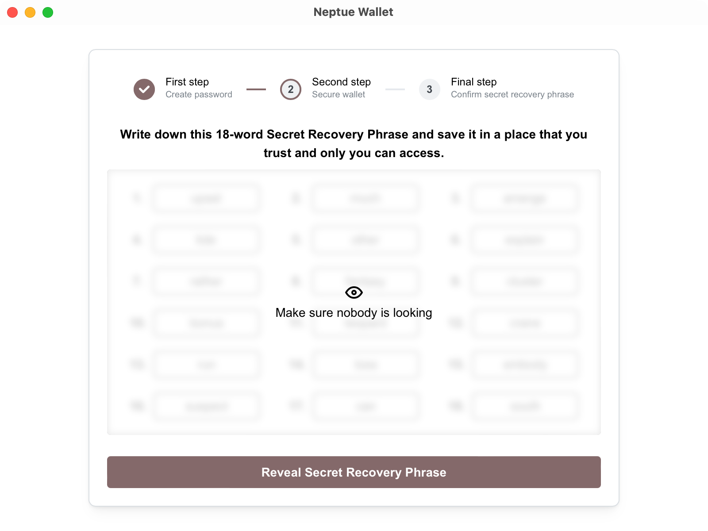
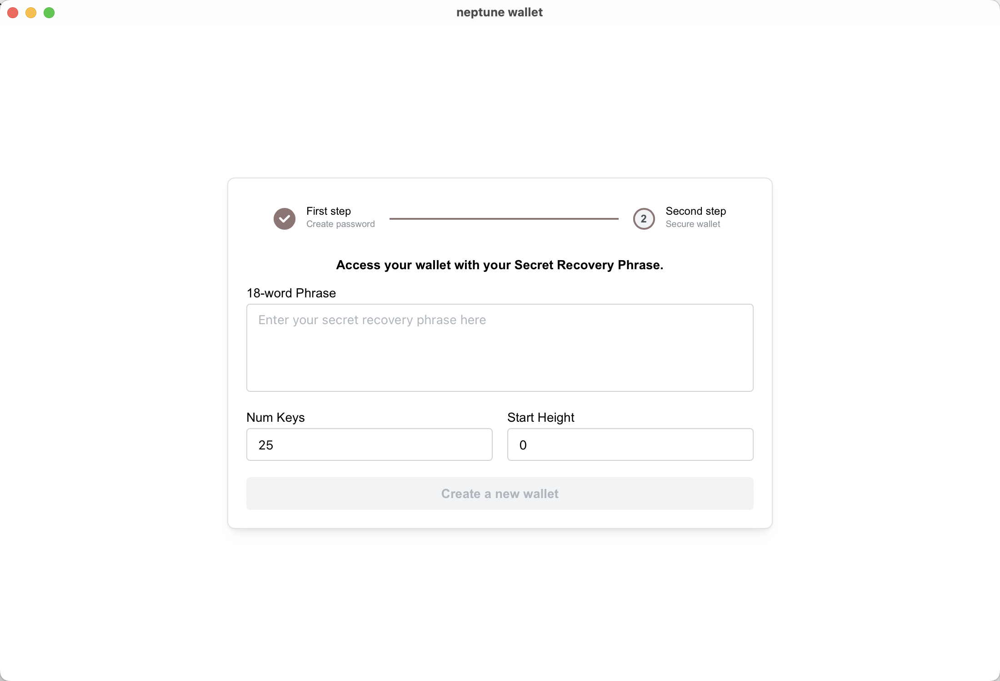
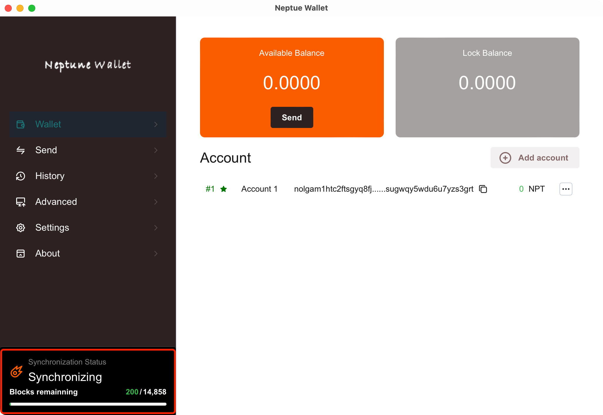
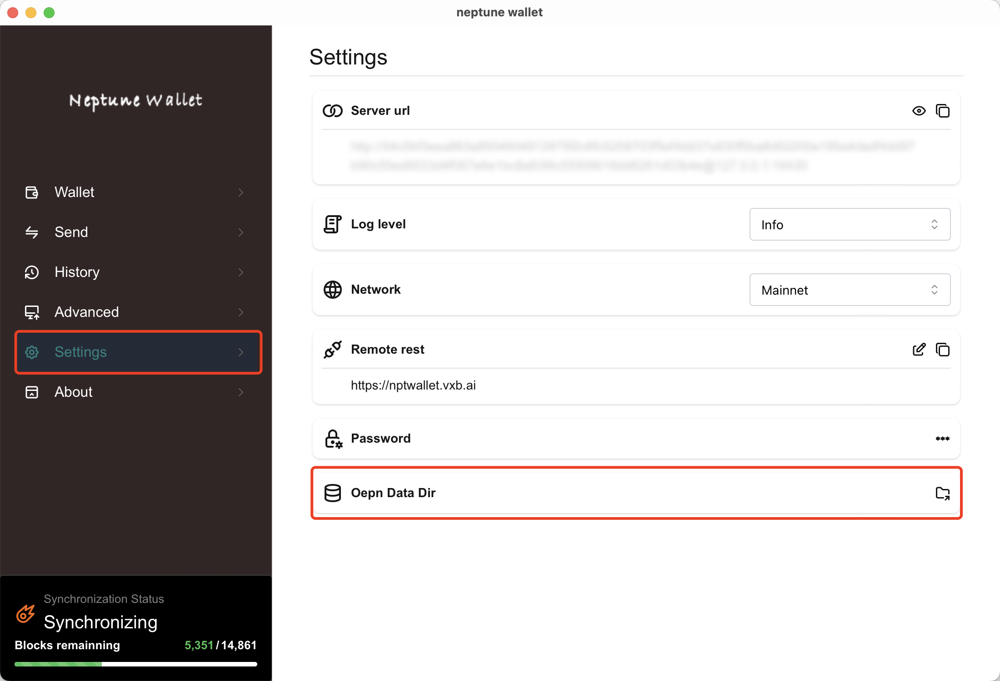
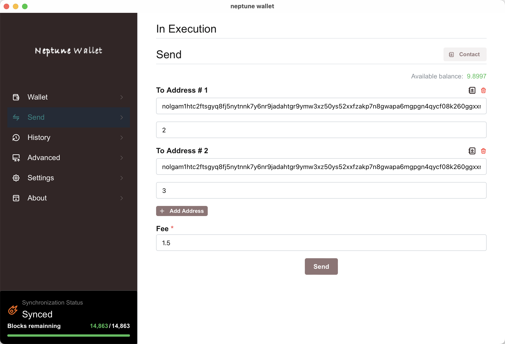
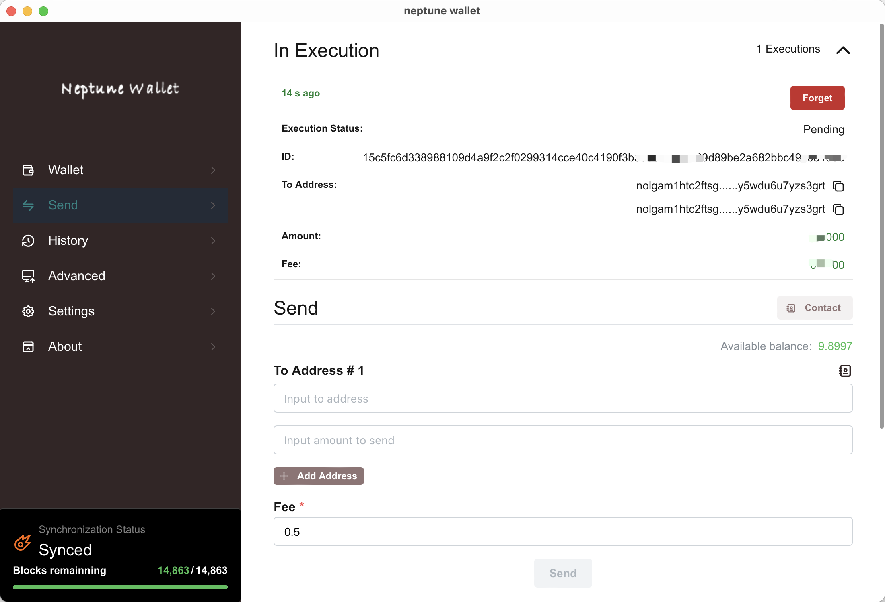
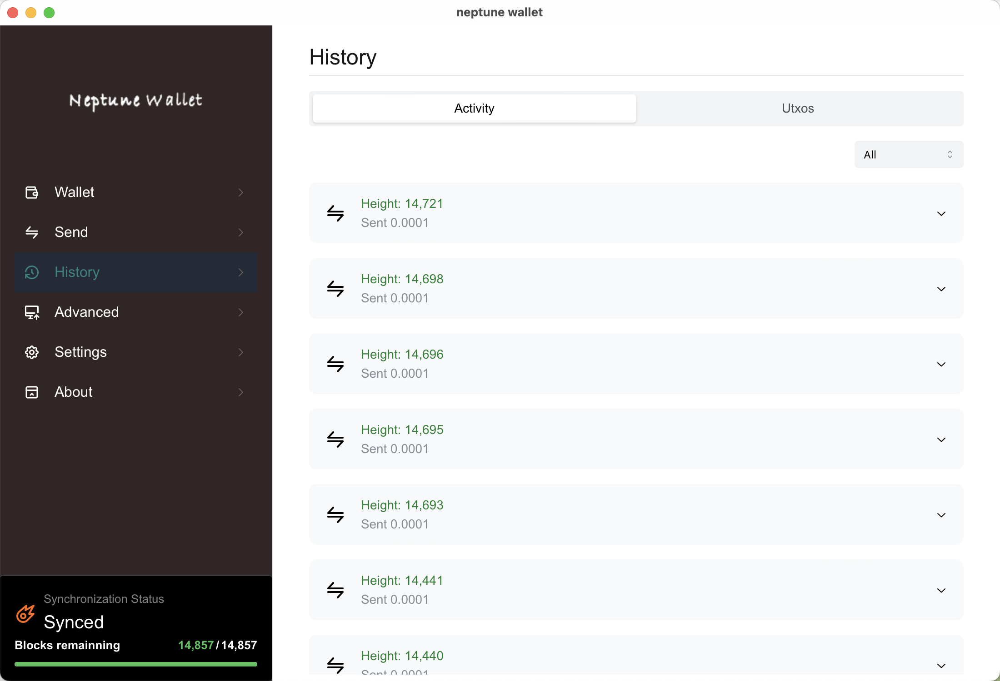
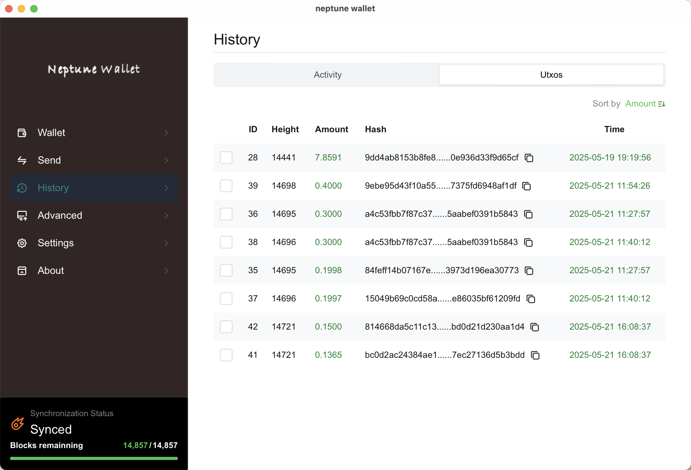

# vxb_neptune_wallet
Neptune's inaugural wallet program

## Download

[latest](https://github.com/VxBlocks/vxb_neptune_wallet/releases/latest)

## Install

Double-click the software

**Mac**
- you need to enable application from any source, drag the app to application folder, then run the following command:

```
sudo xattr -d com.apple.quarantine /Applications/NeptuneWallet.app
```

## Wallet Setup

### Create Wallet


### Import Wallet


## Data Synchronization


**Accelerated Sync via Snapshot**
1. download [snapshot](snapshot.md)
2. Oepn Data Dir

3. Import all snapshots into the currently opened file
4. Restart the App

## Send

1. Enter recipient address
2. Enter transfer amount
3. To send to multiple recipients, click "Add Address"
4. Network fee: Minimum 0.5 NPT (priority increases with fee amount)
5. click "Send"

Processing your transaction...

## History


